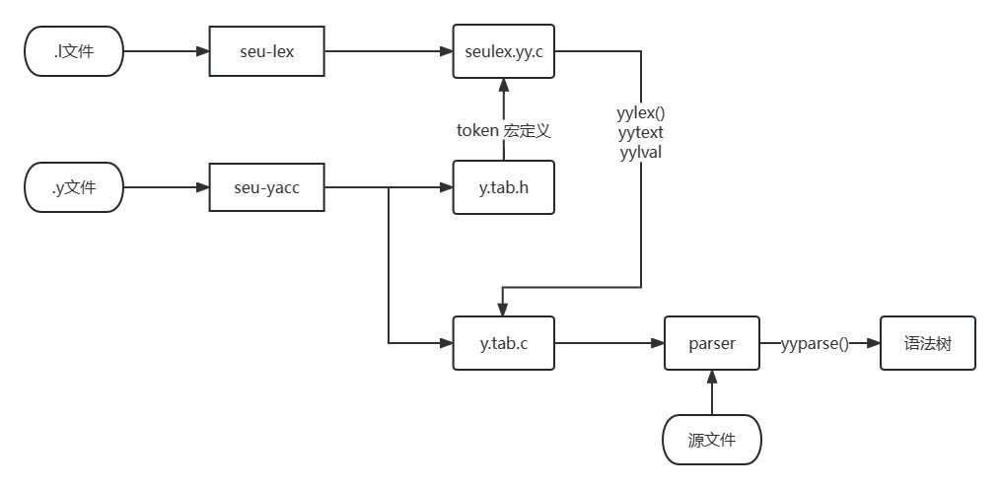

## seu-lex-yacc

### 简介


将.l文件和.y文件分别输入seu-lex和seu-yacc，可生成seulex.yy.c、y.tab.h、y.tab.c三个文件，对生成的C文件进行联合编译，可以得到文法解析程序，在命令行中运行该程序即可实现对源文件的文法解析。

### 特色
* 支持可视化功能，包括NFA、DFA状态转移图可视化，LR(1)和LALR(1)状态转移图和action表goto表的可视化，以及语法树的可视化，项目使用graphviz作为可视化工具。

* 可以处理较大的语言子集，如c99

#### seu-lex 

* 正则表达式支持常用运算符? * + | () “” 字符集合[] 字符集合取反[^] 转义符\

* 支持特殊符号.，表示除换行符外的任意字符

* 支持最小化DFA

* 支持别名定义

* 实现最长匹配原则

* 支持yytext yyleng yylineno yyless() yymore()

#### seu-yacc

* 支持LR(1)转换为LALR(1)

* 支持头部定义规则，终结符声明%token，文法开始符号声明%start，符号类型声明%union %type，优先级定义%left %right %nonassoc。

* 支持二义性文法根据优先级解决冲突

* 支持语义动作执行，并使用$$,$1等获取产生式某一位置的元素，并根据该符号的类型声明确定使用union的哪个域

* 类型声明可以使用户自定义符号表，示例在demo中的symbol_chart_demo

* 可以使用yylineno检测异常出现的行号

* 文法符号（包括终结符和非终结符）在解析中用struct Node保存，方便语义动作的执行和语法树的遍历

* action表用负数表示规约，非负数代表移进，简化了代码

* 用户可以使用outputGraphvizFile()内置函数在解析源文件后生成语法树可视化图片

### 使用说明
项目需要maven和graphviz依赖。

1. 在两个子文件夹seu-lex和seu-yacc下分别执行mvn package -DskipTests，得到两个jar包。

2. 使用
    ```
    java -jar seu-lex-1.0-SNAPSHOT.jar <.l文件名> [options] 

    java -jar seu-yacc-1.0-SNAPSHOT.jar <.y文件名> [options]
   ```

    在命令行中运行seu-lex和seu-yacc工具

    seu-lex 默认输出 seulex.yy.c 一个文件

    seu-yacc 默认输出 y.tab.h y.tab.c 两个文件


    seu-lex 可选参数:
    -v 输出DFA可视化图片

    seu-yacc 可选参数
    -v 输出lr状态转移图可视化图片
    -lalr 构造lalr(1)分析表

3. 将y.tab.c seulex.yy.c联合编译即可输出解析程序（请在.l文件中引入y.tab.h）

    例: ```gcc y.tab.c seulex.yy.c -o parser.exe```

4. 若在.y文件中定义能接受文件名作为参数的main函数，则可以通过命令
    ```
    parser.exe 源文件
    ```
    解析源文件。具体可见demo。

在demo文件夹下可以运行示例。

### 需要graphviz支持
https://www.graphviz.org/

### 参考
[1] https://github.com/z0gSh1u/seu-lex-yacc

感谢17级学长的开源分享，对这个单人完成的项目有很大的帮助作用。

[2] 许畅,陈嘉,朱晓瑞. 编译原理实践与指导教程[M]. 机械工业出版社, 2015.

参考了书中对flex和bison的特性描述。

[3] A.V. Aho, M.S. Lam, R. Sethi, and J.D. Ullman, "Compilers: Principles, Techniques, and Tools," Second Edition, Addison-Wesley, 2007.

教学书目，项目所用算法都基于此书。